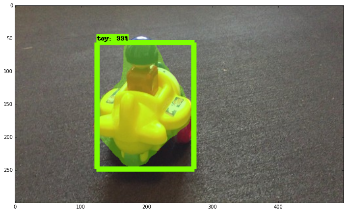
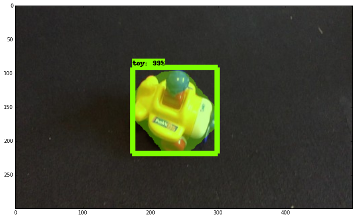
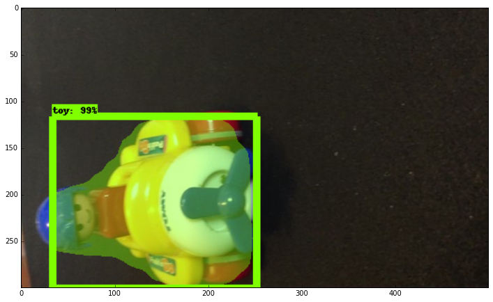

# Mask RCNN (Object Detection) using `tensorflow`

A convolutional neural network (CNN) is mainly for image classification. While an R-CNN, with the R standing for region, is for object detection. ... It is actually possible to regress bounding boxes directly from a CNN but that can only happen for one object at a time.

You can now build a custom Mask RCNN model using [Tensorflow Object Detection Library!](https://github.com/tensorflow/models/tree/master/research/object_detection) Mask RCNN is an instance segmentation model that can identify pixel by pixel location of any object.

> Need tensorflow Version > 1.4, use  `pip install tensorflow==1.4.0`

### Blog Post: [http://kuldeepsinghsidhu.blogspot.com](http://kuldeepsinghsidhu.blogspot.com)

Articles: 
https://kuldeepsinghsidhu.blogspot.com/2018/12/object-detection-using-mask-rcnn-with.html

## Results

## CREDITS

>Kuldeep Singh Sidhu

Github: [github/singhsidhukuldeep](https://github.com/singhsidhukuldeep)
`https://github.com/singhsidhukuldeep`

Website: [Kuldeep Singh Sidhu (Website)](http://kuldeepsinghsidhu.com)
`http://kuldeepsinghsidhu.com`

LinkedIn: [Kuldeep Singh Sidhu (LinkedIn)](https://www.linkedin.com/in/singhsidhukuldeep/)
`https://www.linkedin.com/in/singhsidhukuldeep/`